<picture>
  <source media="(prefers-color-scheme: dark)" srcset="assets/header-dark.svg">
  <source media="(prefers-color-scheme: light)" srcset="assets/header-light.svg">
  
</picture>

  <a href="https://fokamemeric.com"><b>Portfolio</b></a>&nbsp;&nbsp;·&nbsp;&nbsp;<a href="mailto:fokamemeric@gmail.com"><b>Email</b></a>&nbsp;&nbsp;·&nbsp;&nbsp;<a href="https://github.com/emeric-cyrille/wikikgqa-iswc2026"><b>Research</b></a>

 

I design and ship data and AI systems end to end: from research and modelling to the production services, data pipelines and integrations that put them in front of users. My work sits at the intersection of **machine learning**, **LLM-based systems** and **distributed backend engineering**.

**Winner** of the WikiKGQA Challenge @ ISWC 2026 (Spanish, with-mentions track) with an LLM pipeline for text-to-SPARQL over Wikidata.

 

## Areas of work

<table>
<tr>
<td width="50%" valign="top">
<h4>Machine Learning Engineering</h4>
Feature engineering, model selection and evaluation, deep learning with PyTorch and TensorFlow, model serving behind REST APIs. Recommender systems, credit-risk scoring, supervised classification and regression pipelines taken to production.
</td>
<td width="50%" valign="top">
<h4>AI Research</h4>
LLM-based semantic parsing (text-to-SPARQL), knowledge-graph question answering over Wikidata, geometry of multilingual embedding spaces with optimal transport and spectral perturbation theory.
</td>
</tr>
<tr>
<td width="50%" valign="top">
<h4>Agentic AI &amp; LLM Systems</h4>
Agent orchestration with LangChain, LangGraph and CrewAI, tool calling and Model Context Protocol servers, retrieval-augmented generation with LlamaIndex and vector stores (FAISS, Chroma, pgvector), multi-candidate sampling with execution-guided selection, open-weight model inference.
</td>
<td width="50%" valign="top">
<h4>Data Engineering</h4>
ETL pipelines, large-scale web scraping, relational data modelling, ingestion and runtime-data capture, message-based data flows and caching layers.
</td>
</tr>
<tr>
<td width="50%" valign="top">
<h4>Backend Development &amp; Integration</h4>
Microservices and event-driven architectures (RabbitMQ), distributed caching (Redis), authentication and authorisation (JWT, OAuth 2.0), payment gateways and third-party API integration, OpenAPI documentation.
</td>
<td width="50%" valign="top">
<h4>Data Analysis</h4>
Exploratory and statistical analysis, SQL analytics, interactive dashboards (Power BI, R Shiny, React) and decision-oriented reporting.
</td>
</tr>
</table>

 

## Technical stack

<table>
<tr><td><b>Languages</b></td><td>     </td></tr>
<tr><td><b>Machine learning</b></td><td>      </td></tr>
<tr><td><b>LLMs & agentic AI</b></td><td>       </td></tr>
<tr><td><b>Retrieval & vector search</b></td><td>    </td></tr>
<tr><td><b>Data engineering</b></td><td>     </td></tr>
<tr><td><b>Backend & integration</b></td><td>       </td></tr>
<tr><td><b>Analytics & visualisation</b></td><td>    </td></tr>
<tr><td><b>Infrastructure</b></td><td>    </td></tr>
</table>

 

  Experience, projects and full background at <a href="https://fokamemeric.com">fokamemeric.com</a>

